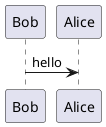

# markdown-it-plantuml-ex

[](https://www.npmjs.com/package/markdown-it-plantuml-ex)
[](https://github.com/xhinliang/markdown-it-plantuml-ex/actions/workflows/ci.yml)
[](https://circleci.com/gh/xhinliang/markdown-it-plantuml-ex)

Plugin for creating block-level UML diagrams in
[markdown-it](https://github.com/markdown-it/markdown-it) using an offline `plantuml.jar`.

Compared to [markdown-it-plantuml](https://github.com/gmunguia/markdown-it-plantuml), this plugin
renders diagrams locally.

- Diagram source stays local and is not sent to an external rendering service.
- Rendering runs against your local Java + PlantUML runtime.
- Java is required on the machine where markdown is rendered.

## Requirements

- Node.js 20+
- Java installed and available on `PATH`

## UML example

````markdown

````

See [plantuml.com](https://plantuml.com) for diagram syntax details.

## Installation

```bash
npm install markdown-it-plantuml-ex
```

## Usage

```js
const md = require('markdown-it')().use(require('markdown-it-plantuml-ex'));
```

With custom markers:

````js
const md = require('markdown-it')().use(require('markdown-it-plantuml-ex'), {
  openMarker: '```plantuml',
  closeMarker: '```',
});
````

## Development

```bash
npm ci
npm run verify
```

Useful scripts:

- `npm run format` - format repository files with Prettier
- `npm run format:check` - verify formatting
- `npm run lint` - run ESLint
- `npm run lint:fix` - auto-fix lint issues
- `npm test` - run test suite
- `npm run verify` - run format check, lint, and tests

## License

[MIT](LICENSE)
